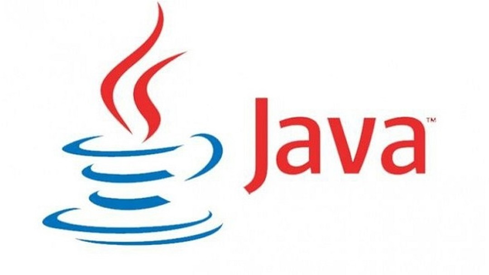

# índice
- [Introdução](#introdução)
- [Classificação](#classificação)
- [Exemplos de codigos](#exemplos-de-codigos)
- [Funcionalidade Lazy Evaluation](#funcionalidade-lazy-evaluation)
- [Bibliografia](#bibliografia)

# Introdução
Scala é uma linguagem de programação open source, moderna e multi-paradigma desenvolvida para expressar padrões de programação comuns em uma forma concisa e com tipagem segura. Integra tanto características de linguagens orientadas a objetos como funcionais.
Scala foi originalmente escrito por Martin Odersky e seu grupo na École Polytechnique Federale de Lausanne, na Suíça. Seu trabalho anterior incluiu a criação da linguagem Funnel, que compartilhava algumas características com o Scala, mas não empregava as JVMs como mecanismo de execução. Odersky começou a trabalhar no Scala em 2001 e continua a desempenhar um papel de liderança no seu desenvolvimento.
Scala é similar a linguagem de programação Java, e roda na Java Virtual Machine, é compatível com programas java existentes.
A implementação em Scala é muito similar a usada em Java ou C. São utilizados os mesmos operadores e controles de estruturas bem similares.
As principais diferenças sintáticas são
  * Definições começam com uma palavra reservada.
  * Em Scala não precisamos declarar explicitamente o tipo das variáveis, pois o próprio compilador infere os tipos no momento do uso delas, o que traz grande flexibilidade na programação.
  * O tipo Array é escrito como Array[V] em vez de V[], e o acesso aos elementos do array é feito, por exemplo, a(i) em vez de a[i].
  * Funções podem ser aninhadas dentro de outras funções. Funções aninhadas podem acessar parâmetros e variáveis locais anexando funções.

# Classificação

* Compilada
	* Por meio de compilador (scalac), cria um arquivo .class pronto para rodar na JVM.

* Open-source
	* Código fonte disponível e permite a colaboração de qualquer desenvolvedor. 

* Orientação a objetos
	* Scala é uma linguagem puramente orientada a objetos no sentido que todo valor é um objeto. Tipos e comportamentos de objetos são descritos por classes e traits. Classes são estendidas por subclasses e por um flexível mecanismo de composição mesclada como uma alternativa para herança múltipla.

* Programação funcional
	* Scala é também uma linguagem funcional no sentido que toda função é um valor. Scala fornece uma sintaxe leve para definir funções anônimas, suporta funções de primeira ordem, permite funções aninhadas, e suporta currying. As case classes da linguagem Scala e o suporte embutido para correspondência de padrões modelam tipos algébricos utilizados em muitas linguagens de programação funcional. Objetos Singleton fornecem uma alternativa conveniente para agrupar funções que não são membros de uma classe.

* Tipagem estática
	* O Scala é equipado com um sistema de tipos expressivo, que reforça estaticamente que abstrações sejam usadas de maneira segura e coerente. Em particular, o sistema de tipos suporta:
		* Classes genéricas
		* Anotações variáveis
		* Limites de tipos superiores e limites de tipos inferiores,
		* Classes internas e tipos abstratos como membros de um objeto
		* Tipos compostos
		* Auto referências explicitamente tipadas
		* parâmetros implícitos e conversões implícitas
		* métodos polimórficos

* Inferência de tipo 
	* O tipo da variável não precisa ser necessariamente declarado, porém não pode mudar de tipo ao longo da execução. Tem tipagem estática, ou seja, existe uma validação no tempo de compilação para evitar erros.

* Extensibilidade
	* Na prática, o desenvolvimento de aplicações de um determinado domínio geralmente requer uma linguagem de domínio específico. Scala fornece uma combinação única de mecanismos de linguagem que facilitam a adição suave de novas construções de linguagem na forma de bibliotecas

* Independência de plataforma
	* Scala foi projetado para interoperar bem com ambientes de programação populares, tais como Java 2 Runtime Environment (JRE) e .NET

# Exemplos de codigos

## Java VS Scala

## _Exemplo Hello World em uma classe main_

~~~
class Exemplo {
    public static void main(String args[]) { 
        System.out.println("Hello World"); 
    } 
}
~~~
### Output
~~~
Hello World
~~~

~~~
object Exemplo {
    def main(args: Array[String]): Unit = {
      println("Hello world")
    }
}
~~~
### Output
~~~
Hello World
~~~

Podemos notar que ambas são bem parecidas, com uma diferença notável em scala sendo o Unit, que representa uma função sem retorno no lugar do clássico void.

## _Pattern Matching_

~~~
class Conta(nAgencia:String, nConta:String, s:Float) {
  
  var numAgencia:String = nAgencia
  var numConta:String = nConta
  var saldo:Float = s
   
  def deposito(valor:Float): Unit = {
    saldo = saldo + valor
  }
  def saque(valor:Float): Boolean = {
    if (saldo - valor >= 0) {      
      saldo = saldo - valor
      return true
    }
    false
  }
  override def toString(): String = 
    "(Agencia:" + numAgencia + ", Conta: " + numConta + ", Saldo: " + saldo + ")";
   
}

object Main {
  def matchTest(x: Any): Any = x match {
    case 1 => "um"
    case "dois" => 2
    case "três" => 3
    case "quatro" => new Conta("12345", "12345", 1000)
    case y: Int => "Eh um número inteiro"
    case x: Conta => "Eh uma conta"
    case z: String => "Eh uma String"
  }
  def main(args: Array[String]): Unit = {
    println(matchTest("dois"))
    println(matchTest(1))
    println(matchTest(5))
    println(matchTest("três"))
    println(matchTest("quatro"))
  }
}
~~~
### Output
~~~
2
um
Eh um número inteiro
3
(Agencia:12345, Conta: 12345, Saldo: 1000.0)
~~~

~~~
public class Main{

    public static class Conta{
        String Agencia;
        String Conta;
        Float Saldo;
        public Conta(String a, String b, Float c){
            this.Agencia = a;
            this.Conta = b;
            this.Saldo = c;
        }
        public void deposito(Float valor){
            Saldo = Saldo + valor;
        }
        public Boolean saque(Float valor){
            if (Saldo - valor >= 0) {      
                Saldo = Saldo - valor;
                return true;
              }
              return false;
        }
        @Override
        public String toString(){
            return "(Agencia:" + Agencia + ", Conta: " + Conta + ", Saldo: " + Saldo + ")";
        }
    }

    public static class MatchTest{
        String a;
        public MatchTest(int x){
            if (x == 1){
                this.a = "um";
            }else{
                this.a = "Eh um numero";
            }
        }
        public MatchTest(String a){
            if(a == "dois"){
                this.a = "2";
            }else if(a == "tres"){
                this.a = "3";
            }else if(a == "quatro"){
                this.a = new Conta("12345", "12345", 1000f).toString();
            }else{
                this.a = "Eh uma string";
            }
        }
        public MatchTest(Conta a){
            this.a = "Eh uma conta";
        }
        @Override
        public String toString(){
            return a;
        }
    }
    public static void main(String args[]){
        System.out.println(new MatchTest("dois"));
        System.out.println(new MatchTest(1));
        System.out.println(new MatchTest(5));
        System.out.println(new MatchTest("tres"));
        System.out.println(new MatchTest("quatro"));
    }

}
~~~

### Output
~~~
2
um
Eh um número inteiro
3
(Agencia:12345, Conta: 12345, Saldo: 1000.0)
~~~

# Funcionalidade For Comprehension

For Comprehensions em Scala nada mais é que uma sintaxe resumida para criação de loops.

Ela possui a seguinte forma:
	for (enumerators) yield corpo,
onde enumerators refere a uma lista separada de enumerators. Um enumerator pode ser tanto um generator que introduz novas variaveis, como pode ser um filtro. 
A comprehension avalia o corpo para cada binding gerada pelos enumerators e retorna a sequencia com esses valores.

Um exemplo simples
~~~
for(i <- 1 to 10) yield i*i
~~~

### Output
~~~
Vector(1, 4, 9, 16, 25, 36, 49, 64, 81, 100)
~~~

Neste exemplo o valor do i vai variar de 1 até 10 e o programa vai gerar um vetor de inteiros e vai mapear para cada valor com o resultado de i*i

um outro exemplo

~~~
val comb = for {
          x <- 1 to 2
          y <- 'a' to 'd'
        } yield (x,y)
        
        println(comb)
~~~

O resultado será uma combinação de x e y
### Output
~~~
Vector((1,a), (1,b), (1,c), (1,d), (2,a), (2,b), (2,c), (2,d))
~~~

Times de baseball
~~~
object MyClass {
    
    case class Player(name: String, position: String)
        
    def main(args: Array[String]) {
        
        val heat = List(
            Player("Mario Chamlers", "PG"),
            Player("Dwayne Wade", "SG"),
            Player("LeBron Jame", "SF"),
            Player("Udonis Haslem", "PF"),
            Player("Chris Bosh", "C")
        )
        
        val guards = for (player <- heat if player.position endsWith "G") yield player.name
            
        val forwards = heat
            .withFilter(_.position endsWith "F")
            .map(_.name)
        
        val centre = heat
            .withFilter(player => player.position == "C")
            .map(player => player.name)
            .head
        
        val scoreSheet = for (Player(name, _) <- heat) yield (name, 0)
    
        def points = util.Random.nextInt(30)
        
        val vsThunder = scoreSheet map { case (p, _) => (p, points) }
        
        val vsCeltics = scoreSheet map { s => (s._1, points) }
        
        val vsLakers = scoreSheet map { sheet => val (p, _) = sheet; (p, points) }
        
        val totalScores = (vsThunder ++ vsCeltics ++ vsLakers)
                            .groupBy(_._1)
                            .mapValues(_.map(_._2).sum)
                            .toList
                            .sortBy(_._2) // sort by ASC score
                            .map { case (p, s) => p + " [" + s + "]" }
                            .mkString("\n")
            
        println(totalScores)
   }
}
~~~

### Output
~~~
LeBron Jame [21]
Mario Chamlers [34]
Chris Bosh [40]
Udonis Haslem [41]
Dwayne Wade [65]
~~~

tendo o seguinte problema: é preciso construir um carro composto de 3 partes, motor, roda e corpo.

~~~
private def body(): Option[Body] = Some(new Body())

private def wheels(): Option[Wheels] = Some(new Wheels())

private def engine(): Option[Engine] = Some(new Engine())
~~~

em Scala podemos facilmente resolver este problema usando a funcionalidade for comprehensions

~~~
var car = for {
 engine <- engine()
 wheels <- wheels()
 body <- body()
} yield Car(body, engine, wheels)
~~~

O for comprehensions nada mais é que uma mistura de sintaxes feito para deixar o codigo mais elegante e interpretando varias funcionalidades como foreach, map, filter, etc...
e o compilador traduz de acordo com o contexto.
neste caso o codigo vai ser traduzido pelo compilador para:

~~~
engine().flatMap(engine => wheels().flatmap(wheels => body().map(engine, wheels,body)))
~~~

nesse exemplo vemos que as for comprehensions começam a ser uteis para a regibilidade e legibilidade do codigo especialmente quando começamos a aninhar varios map

supondo que não existisse essa função em java por exemplo e tivessemos que utilizar apenas o map, flatmap para esta situação teriamos algo parecido com isso

~~~
final Option<Car> car = body().flatMap(b -> engine().flatMap(e -> wheels().map(w -> new Car(b, e, w))));
~~~

# Desconsiderar

## Funcionalidade Lazy Evaluation

Lazy evaluation é uma técnica de avaliação de expressões que consiste em não atribuir um valor ou calcular uma expressão até que ela seja necessária, por isso o apelido "preguiçosa" ela não fará nada até ser chamada.

Declarando uma variável como Lazy:
~~~
lazy val x = 10
~~~

Exemplo de uma função lazy "Call by name":
~~~
object exemplo {

    def add(a: Int, b: Int) : Int = {
        println("Eu acabei de ser executado pelo programa!");
        a+b
    }
    
    def exemploLazy(x: => Int) : Unit = {
       println("Chamada Lazy")
       println(x)
    }

    def exemploStatic(x: Int) : Unit = {
        println("Chamada Estatica")
        println(x)
    }
    
    def main(args: Array[String]) : Unit = {
        exemploStatic(add(2,3))
        exemploLazy(add(2,3))
    }
}
~~~
### Output
~~~
Eu acabei de ser executado pelo programa!
Chamada Estatica
5
Chamada Lazy
Eu acabei de ser executado pelo programa!
5
~~~
Como se pode perceber pelo exemplo, no tradicional método estático, a função de soma foi executada antes mesmo da chamada, diferente do método lazy (indicado pela seta => no parâmetro da expressão) que esperou até que o valor fosse usado dentro da função.

Mas qual a vantagem?
#### Otimização do programa
Como a variável só será executada no momento de sua chamada é possível que ela nunca seja usada, evitando desperdício de memória.
Com essa opção é possível até mesmo construir estruturas de dados infinitas.

#### Lazy Lists

A lazy list é uma técnica utilizada para criar listas a tempo de execução, elas "não existem" até serem chamadas pelo programa, dessa forma é possível fazer estruturas de dados praticamente infinitas, apenas sendo limitadas é claro pela memória finita do computador.

~~~
import Stream.cons

// função adicionando a lazylist
def addLazyList(n: Int): LazyList[Int] ={
  LazyList.cons(n, addLazyList(n+1))
}

//declarando a lazy list
val positiveintegers = addLazyList(1)

//imprimindo a lazy list antes de ser chamada
println(positiveintegers)

//imprimindo os 5 primeiros numeros
positiveintegers.take(5) foreach println
~~~

### Output
~~~
LazyList(<not computed>)
1
2
3
4
5
~~~

Como se percebe nesse exemplo a lazy list quando declarada não é computada, até o momento onde foi solicitado a sua execução.

# Bibliografia

* https://pt.wikipedia.org/wiki/Scala_(linguagem_de_programa%C3%A7%C3%A3o)
* https://docs.scala-lang.org/
* https://www.geeksforgeeks.org/scala-lazy-evaluation/
* https://dzone.com/articles/scala-lazy-evaluation
* https://www.youtube.com/watch?v=iromVyC0mDs
* https://www.scala-exercises.org/scala_tutorial/lazy_evaluation
* https://scalafiddle.io/
* https://www.devmedia.com.br/conheca-a-linguagem-scala/32850
* https://scastie.scala-lang.org/
* http://cocic.cm.utfpr.edu.br/progconcorrente/doku.php?id=scala
* https://docs.scala-lang.org/tutorials/FAQ/yield.html
* https://docs.scala-lang.org/tour/for-comprehensions.html
* https://www.youtube.com/watch?v=r86DvO_wsZ0
* https://www.rallyhealth.com/coding/comprehending-for-comprehensions
* https://eddmann.com/posts/using-for-comprehensions-in-scala/
* https://blog.softwaremill.com/code-for-comprehension-3cfb60236a83

